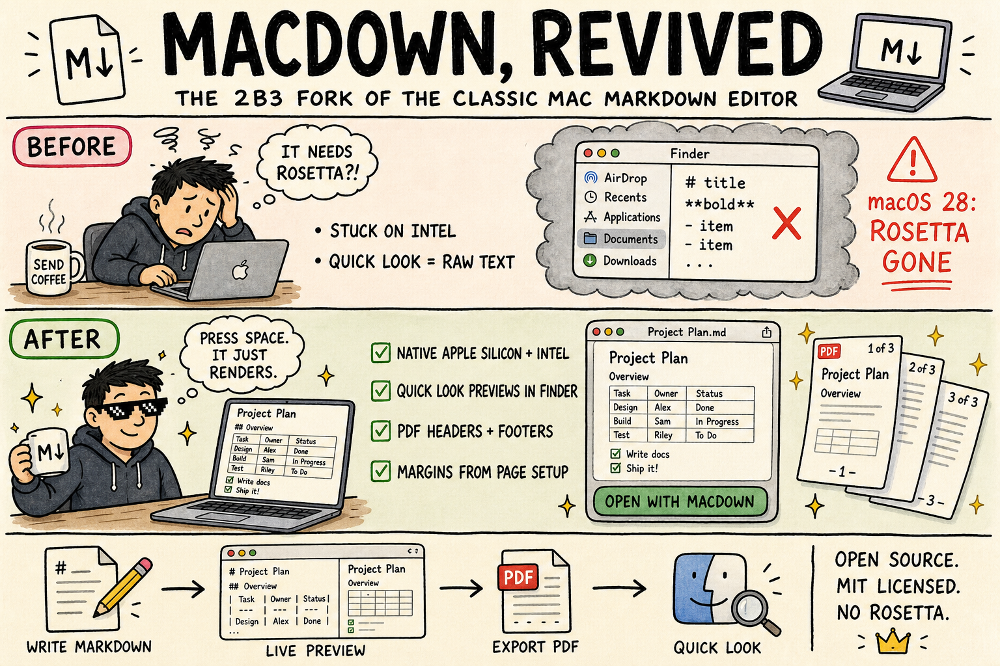

# MacDown (2b3pro fork)

MacDown is an open source Markdown editor for macOS, created by [Tzu-ping Chung](https://github.com/uranusjr) and released under the MIT License. This repository is a maintained fork of [MacDownApp/macdown](https://github.com/MacDownApp/macdown) that brings the app to current macOS and Xcode, runs natively on Apple Silicon, and adds a handful of features around printing, PDF export, and Finder integration.

Upstream has been quiet since 2020, and its last release (0.7.3) ships an Intel-only Sparkle framework that needs Rosetta. This fork removes that dependency.

## What is different in this fork

**Platform and build**

* Builds with current Xcode (27) against the macOS 13 SDK; deployment target is macOS 13 (Ventura) or later.
* Universal binaries (arm64 + x86_64) for the app, the command line tool, the Quick Look extension, and Sparkle. Nothing in the bundle requires Rosetta.
* Sparkle updated from 1.18 to 1.27 (last 1.x line, same API, universal). CocoaPods dependencies are lifted to the app's deployment target so the project builds again on modern Xcode.

**Quick Look extension**

* Select a `.md` or `.markdown` file in Finder and press Space to see it rendered with your MacDown preview style.
* The extension honors your MacDown rendering preferences: Markdown extensions, SmartyPants, table of contents, task lists, hard wrap, and YAML front matter detection. It falls back to the GitHub2 style if your selected style file cannot be found.
* Quick Look does not run JavaScript, so Prism syntax highlighting, MathJax, and Mermaid are not rendered in previews.

**Printing and PDF export**

* Optional headers and footers on exported and printed PDFs. Each of the six zones (header/footer, left/center/right) can show the document name, a timestamp, page number, page count, "Page X of Y", or custom text. A different first page and the font size are configurable in a new **PDF** preferences pane.
* Margins now follow **File > Page Setup** instead of hardcoded values, and the bundled stylesheets no longer add their own print margins, so whitespace is predictable.
* User-configurable print content padding in the **Rendering** preferences.

**Markdown parser**

* Markdown is now parsed by [cmark-gfm](https://github.com/github/cmark-gfm), GitHub's implementation of CommonMark and GitHub Flavored Markdown, replacing Hoedown. Documents render the way they do on GitHub, and the spec's edge cases (nested lists, emphasis next to punctuation, HTML blocks) behave predictably.
* Tables, footnotes, strikethrough, autolinks and task lists use the GFM syntax. Highlight (`==text==`), superscript (`^word`, `^(words)`), underline (`_text_`) and math (`$$…$$`, `\\(…\\)`, `\\[…\\]`, and optionally `$…$`) are kept as MacDown extensions, each toggled in **Preferences > Markdown**.
* MacDown's extensions are small, self-contained cmark-gfm syntax extensions. See [`MacDown/Code/Markdown/Extensions/README.md`](MacDown/Code/Markdown/Extensions/README.md) to write your own.
* Differences from Hoedown: headings need a space after `#`, a single `~` also strikes through (as on GitHub), footnotes use GitHub's markup, and the rarely used Quote extension (`"text"` to `<q>`) is gone. SmartyPants now handles quotes, dashes and ellipses but no longer converts `(c)`, `(tm)` or fractions.

**Rendering**

* YAML front matter is stripped from the preview and from printed output instead of being rendered as a table.
* New **GitHub-2020** preview style.
* Mermaid updated from 8.4.3 to 12.1.0, adding mindmaps, timelines, XY charts, Sankey, block, architecture, and the other newer diagram types. Diagrams follow the preview style's light or dark background instead of always using the "forest" theme. Turn it on with **Rendering > Mermaid** (requires syntax highlighting).

**Preferences window**

* Panels use Auto Layout and keep a consistent width when switching between them.

## Install

There is no Homebrew cask for this fork (the `macdown` cask installs upstream 0.7.3). Build from source as described below, or download a prebuilt app from this repository's [Releases](https://github.com/2b3pro/macdown/releases) page when one is available, unzip it, and drag it to your Applications folder.

The Quick Look extension is registered by macOS once the app is in your Applications folder. If Finder previews do not change right away, launch MacDown once.

In-app update checks still point at the upstream Sparkle feed, which only carries older releases, so they will not offer anything for this fork.

## Screenshot

## License

MacDown is released under the terms of the MIT License; see [LICENSE.txt](LICENSE.txt). This fork keeps the same license. The original upstream license text is also in `LICENSE/macdown.txt`.

You may find full text of licenses about third-party components in the `LICENSE` directory, or the **About MacDown** panel in the application.

The following editor themes and CSS files are extracted from [Mou](http://mouapp.com), courtesy of Chen Luo:

* Mou Fresh Air
* Mou Fresh Air+
* Mou Night
* Mou Night+
* Mou Paper
* Mou Paper+
* Tomorrow
* Tomorrow Blue
* Tomorrow+
* Writer
* Writer+
* Clearness
* Clearness Dark
* GitHub
* GitHub2

## Development

### Requirements

* Xcode 15 or later with the macOS 13 SDK (the app and its Quick Look extension target macOS 13.0)
* Git
* [CocoaPods](https://cocoapods.org) 1.16 or later, either via [Bundler](http://bundler.io) or installed directly (`brew install cocoapods`)

> Note: The Command Line Tools (CLT) should be unnecessary. If you failed to compile without it, please install CLT with
>
>     xcode-select --install
>
> and report back.

### Environment Setup

After cloning the repository, run the following commands inside the repository root (directory containing this `README.md` file):

    git submodule update --init
    pod install
    make -C Dependency/peg-markdown-highlight

and open `MacDown.xcworkspace` in Xcode. The first command initialises the dependency submodule(s) used in MacDown; the second one installs dependencies managed by CocoaPods. If you use Bundler, run `bundle install` and then `bundle exec pod install` instead.

If you run into build issues later on, try running the following commands to update dependencies:

    git submodule update
    pod install

### Targets

* **MacDown**: the application.
* **MacDownQuickLook**: the Quick Look preview extension, embedded in the app bundle. It links cmark-gfm and compiles MacDown's Markdown renderer (`MacDown/Code/Markdown`) directly, so it stays in sync with the app's rendering.
* **macdown-cmd**: the `macdown` command line utility, copied into the app bundle.
* **MacDownTests**: unit tests.

### Versioning

The short version comes from the newest `v*` tag when building exactly at that tag. Otherwise it is the value in `Tools/version.txt` with a `d<commits since tag>` suffix (for example `0.10.0d12`). Both the app and the Quick Look extension are stamped with the same version at build time. Bump `Tools/version.txt` when starting work on a new release, and tag the release commit `vX.Y.Z`.

### Translation

Localizations are inherited from upstream, which manages them on [Transifex](https://www.transifex.com/macdown/macdown/). New strings added in this fork are English only for now.

## Discussion

Please [file an issue](https://github.com/2b3pro/macdown/issues/new) on this repository for problems with the fork-specific features listed above. **Search first to make sure no-one has reported the same issue already.**

MacDown depends a lot on other open source projects, such as [cmark-gfm](https://github.com/github/cmark-gfm) for Markdown-to-HTML rendering, [Prism](http://prismjs.com) for syntax highlighting (in code blocks), and [PEG Markdown Highlight](https://github.com/ali-rantakari/peg-markdown-highlight) for editor highlighting. If you find problems when using those particular features, consider reporting them to the upstream projects as well.

## Upstream and credits

MacDown was created and maintained by Tzu-ping Chung. Visit the original [project site](http://macdown.uranusjr.com/) and [repository](https://github.com/MacDownApp/macdown), and if MacDown is useful to you, consider [tipping the original author](http://macdown.uranusjr.com/faq/#donation). The author's own words: the idea was borrowed from [Chen Luo](https://twitter.com/chenluois)'s [Mou](http://mouapp.com) "so that people can make crappy clones."

Fork maintained by [Ian Shen](https://github.com/2b3pro).

---

## Support

MacDown is free and always will be. But I won't stop you from buying me a coffee and croissant for my fork of MacDown!

**[Buy me a cup of coffee and croissant!](https://paypal.me/2b3/10)**

---