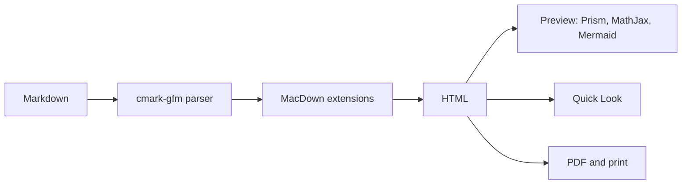

# MacDown (2b3pro fork)


[](LICENSE.txt)


MacDown is an open source Markdown editor for macOS, created by [Tzu-ping Chung](https://github.com/uranusjr) and released under the MIT License. This repository is a maintained fork of [MacDownApp/macdown](https://github.com/MacDownApp/macdown) that brings the app to current macOS and Xcode, runs natively on Apple Silicon, and adds a handful of features around printing, PDF export, and Finder integration.

Upstream has been quiet since 2020, and its last release (0.7.3) ships an Intel-only Sparkle framework that needs Rosetta. This fork removes that dependency.

> **This README is also a sample document.** It uses every kind of Markdown MacDown understands, so opening it in MacDown is a quick tour of the renderer. GitHub renders the standard parts; a few MacDown extensions (highlight, superscript, underline) only light up in MacDown. The **Markdown showcase** section below lists which preference turns on what.

## What is different in this fork

### Platform and build

* Builds with current Xcode (27) against the macOS 13 SDK; deployment target is macOS 13 (Ventura) or later.
* Universal binaries (`arm64` + `x86_64`) for the app, the command line tool, the Quick Look extension, and Sparkle. Nothing in the bundle requires Rosetta.
* Sparkle updated from 1.18 to 1.27 (last 1.x line, same API, universal). CocoaPods dependencies are lifted to the app's deployment target so the project builds again on modern Xcode.

### Markdown parser

* Markdown is parsed by [cmark-gfm](https://github.com/github/cmark-gfm), GitHub's implementation of CommonMark and GitHub Flavored Markdown, replacing Hoedown. Documents render the way they do on GitHub, and the spec's edge cases (nested lists, emphasis next to punctuation, HTML blocks) behave predictably.
* Highlight, superscript, underline and math are kept as MacDown extensions, each toggled in **Preferences > Markdown** or **Preferences > Rendering**.
* Each extension is a small, self-contained cmark-gfm syntax extension. See [`MacDown/Code/Markdown/Extensions/README.md`](MacDown/Code/Markdown/Extensions/README.md) to write your own.
* Differences from Hoedown:
  1. Headings need a space after `#`.
  2. A single `~` also strikes through, as on GitHub.
  3. Footnotes use GitHub's markup.
  4. The rarely used Quote extension (`"text"` to `<q>`) is gone.
  5. SmartyPants handles quotes, dashes and ellipses, but no longer converts `(c)`, `(tm)` or fractions.

### Quick Look extension

* Select a `.md` or `.markdown` file in Finder and press <kbd>Space</kbd> to see it rendered with your MacDown preview style.
* The extension honors your MacDown rendering preferences: Markdown extensions, SmartyPants, table of contents, task lists, hard wrap, and YAML front matter detection. It falls back to the GitHub2 style if your selected style file cannot be found.
* Quick Look does not run JavaScript, so Prism syntax highlighting, MathJax, and Mermaid are not rendered in previews.

### Printing and PDF export

* Optional headers and footers on exported and printed PDFs. Each of the six zones (header/footer, left/center/right) can show the document name, a timestamp, page number, page count, "Page X of Y", or custom text. A different first page and the font size are configurable in a new **PDF** preferences pane.
* Margins now follow **File > Page Setup** instead of hardcoded values, and the bundled stylesheets no longer add their own print margins, so whitespace is predictable.
* User-configurable print content padding in the **Rendering** preferences.

### Rendering and preferences

* YAML front matter (a `---` block at the very top of the file) is stripped from the preview, Quick Look and printed output instead of being rendered as a table. Its `title` is used as the document title. Turn it off with **Rendering > Detect Jekyll front-matter**.
* New **GitHub-2020** preview style.
* Mermaid updated from 8.4.3 to 12.1.0, adding mindmaps, timelines, XY charts, Sankey, block, architecture, and the other newer diagram types. Diagrams follow the preview style's light or dark background instead of always using the "forest" theme.
* Preference panels use Auto Layout and keep a consistent width when switching between them.

### Status

- [x] Native Apple Silicon build, no Rosetta
- [x] Quick Look previews in Finder
- [x] CommonMark + GFM parser
- [x] Mermaid 12
- [ ] Homebrew cask for this fork
- [ ] An update feed for this fork's releases

## Markdown showcase

Everything in this section is live Markdown. Turn on the options in the last column to see all of it in MacDown.

### Text

| Feature | You type | You get | Turn on in MacDown |
|:--------|:---------|:--------|:-------------------|
| Bold | `**bold**` | **bold** | always on |
| Italic | `*italic*` | *italic* | always on |
| Bold italic | `***both***` | ***both*** | always on |
| Inline code | `` `code` `` | `code` | always on |
| Strikethrough | `~~struck~~` | ~~struck~~ | Markdown > Strikethrough |
| Highlight | `==marked==` | ==marked== | Markdown > Highlight |
| Superscript | `E = mc^2` | E = mc^2 | Markdown > Superscript |
| Underline | `_underlined_` | _underlined_ | Markdown > Underline |
| Autolink | `https://commonmark.org` | https://commonmark.org | Markdown > Autolink |
| Keyboard keys | `<kbd>⌘</kbd> <kbd>S</kbd>` | <kbd>⌘</kbd> <kbd>S</kbd> | always on (raw HTML) |
| Smart punctuation | `"quotes" -- and...` | "quotes" -- and... | Markdown > Smartypants |

Without Underline, `_text_` is ordinary italics, which is also how GitHub shows it.

### Lists

1. Ordered lists number themselves
2. They can nest:
   * an unordered item
   * another, with `code`
     1. and a third level
3. Task lists sit alongside them (**Rendering > Task list syntax**), like the **Status** checklist above.

### Quotes

> Markdown is intended to be as easy-to-read and easy-to-write as is feasible.
>
> > Quotes nest, and can hold **any** other Markdown.
>
> John Gruber, [Markdown: Syntax](https://daringfireball.net/projects/markdown/syntax)

### Code

Fenced code blocks are highlighted by Prism (**Rendering > Syntax highlighted code block**). This is how MacDown renders Markdown internally:

```objc
MPMarkdownOptions options = {0};
options.extensions = MPMarkdownExtensionTables | MPMarkdownExtensionMath;
options.renderFlags = MPMarkdownRenderTOC;

char *html = MPMarkdownRenderHTML(text.UTF8String, strlen(text.UTF8String),
                                  &options);
```

### Math

With **Rendering > TeX-like math syntax** on, MacDown typesets math with MathJax (it needs an Internet connection). GitHub renders the same block:

$$
\int_{-\infty}^{\infty} e^{-x^2} \, dx = \sqrt{\pi}
$$

Inline math uses `\\(` and `\\)` in MacDown, or `$…$` with **Use dollar sign ($) as inline delimiter**. Math is passed through untouched, so underscores and asterisks inside a formula are never mistaken for Markdown.

### Diagrams

With **Rendering > Mermaid** on (it needs syntax highlighting), fenced `mermaid` blocks become diagrams. GitHub draws this one too. It shows how a document reaches the screen:



### Footnotes

Footnotes are on by default.[^parser] Write the note anywhere in the document; MacDown numbers them in reading order and collects them at the end.

[^parser]: The footnote syntax is the one GitHub uses, so documents look the same in both places.

### Table of contents

With **Rendering > Detect table of contents token** on, a paragraph containing only `[TOC]` becomes a linked outline of the document's headings.

### Front matter

A YAML front matter block at the top of a file (as used by Jekyll, Hugo and many note apps) is hidden from the preview and from exports, so metadata never shows up as stray text.

### Collapsible sections

<details>
<summary>Raw HTML passes through, so this works in MacDown and on GitHub</summary>

Anything inside a `<details>` element stays hidden until you open it. Leave a blank line after `<summary>` so the content is parsed as Markdown.

</details>

---

## Install

There is no Homebrew cask for this fork (the `macdown` cask installs upstream 0.7.3). Build from source as described below, or download a prebuilt app from this repository's [Releases](https://github.com/2b3pro/macdown/releases) page when one is available, unzip it, and drag it to your Applications folder.

The Quick Look extension is registered by macOS once the app is in your Applications folder. If Finder previews do not change right away, launch MacDown once.

This fork has its own bundle identifier, `com.2b3pro.macdown`, so it keeps its own settings and can be told apart from upstream MacDown. On first launch it copies your settings from upstream MacDown (`com.uranusjr.macdown`); custom styles and themes in `~/Library/Application Support/MacDown` are shared as before.

Update checks are turned off until this fork has its own update feed, so **Check for Updates** is hidden for now. Watch the [Releases](https://github.com/2b3pro/macdown/releases) page for new versions.

## Screenshot


## License

MacDown is released under the terms of the MIT License; see [LICENSE.txt](LICENSE.txt). This fork keeps the same license. The original upstream license text is also in `LICENSE/macdown.txt`.

You may find full text of licenses about third-party components in the `LICENSE` directory, or the **About MacDown** panel in the application.

The following editor themes and CSS files are extracted from [Mou](http://mouapp.com), courtesy of Chen Luo:

| Editor themes | Preview styles |
|:--------------|:---------------|
| Mou Fresh Air, Mou Fresh Air+ | Clearness, Clearness Dark |
| Mou Night, Mou Night+ | GitHub, GitHub2 |
| Mou Paper, Mou Paper+ | |
| Tomorrow, Tomorrow Blue, Tomorrow+ | |
| Writer, Writer+ | |

## Development

### Requirements

* Xcode 15 or later with the macOS 13 SDK (the app and its Quick Look extension target macOS 13.0)
* Git
* [CocoaPods](https://cocoapods.org) 1.16 or later, either via [Bundler](http://bundler.io) or installed directly (`brew install cocoapods`)

> **Note:** The Command Line Tools (CLT) should be unnecessary. If you failed to compile without them, install them and report back:
>
> ```sh
> xcode-select --install
> ```

### Environment setup

After cloning the repository, run the following inside the repository root (the directory containing this `README.md`):

```sh
git submodule update --init
pod install
make -C Dependency/peg-markdown-highlight
```

Then open `MacDown.xcworkspace` in Xcode. The first command initializes the dependency submodules, the second installs dependencies managed by CocoaPods (including the vendored cmark-gfm in `Dependency/cmark-gfm`), and the third builds the editor's syntax highlighter. If you use Bundler, run `bundle install` and then `bundle exec pod install` instead.

If you run into build issues later on, update the dependencies:

```sh
git submodule update
pod install
```

### Targets

| Target | What it is |
|:-------|:-----------|
| **MacDown** | The application. |
| **MacDownQuickLook** | The Quick Look preview extension, embedded in the app bundle. It links cmark-gfm and compiles MacDown's Markdown renderer (`MacDown/Code/Markdown`) directly, so it stays in sync with the app's rendering. |
| **macdown-cmd** | The `macdown` command line utility, copied into the app bundle. |
| **MacDownTests** | Unit tests, including the Markdown rendering tests in `MPMarkdownTests.m`. |

### Versioning

Builds are referred to as **vX.Y.Z (build N)**, which is also how the About window shows them. The version comes from the newest `v*` tag when building exactly at that tag, and otherwise from `Tools/version.txt`. The build number is the count of commits on `master`, with `.<commits on the branch>` added for branch builds (for example `1121.2`). Both the app and the Quick Look extension are stamped at build time. Bump `Tools/version.txt` when starting work on a new release, and tag the release commit `vX.Y.Z`.

### Translation

Localizations are inherited from upstream, which manages them on [Transifex](https://www.transifex.com/macdown/macdown/). New strings added in this fork are English only for now.

## Discussion

Please [file an issue](https://github.com/2b3pro/macdown/issues/new) on this repository for problems with the fork-specific features listed above. **Search first to make sure no-one has reported the same issue already.**

MacDown depends a lot on other open source projects, such as [cmark-gfm](https://github.com/github/cmark-gfm) for Markdown-to-HTML rendering, [Prism](http://prismjs.com) for syntax highlighting (in code blocks), and [PEG Markdown Highlight](https://github.com/ali-rantakari/peg-markdown-highlight) for editor highlighting. If you find problems when using those particular features, consider reporting them to the upstream projects as well.

## Upstream and credits

MacDown was created and maintained by Tzu-ping Chung. Visit the original [project site](http://macdown.uranusjr.com/) and [repository](https://github.com/MacDownApp/macdown), and if MacDown is useful to you, consider [tipping the original author](http://macdown.uranusjr.com/faq/#donation). The author's own words: the idea was borrowed from [Chen Luo](https://twitter.com/chenluois)'s [Mou](http://mouapp.com) "so that people can make crappy clones."

Fork maintained by [Ian Shen](https://github.com/2b3pro).

---

## Support

MacDown is free and always will be. But I won't stop you from buying me a coffee and croissant for my fork of MacDown!

<a href="https://paypal.me/2b3/5">
  
</a>

**[Buy me a cup of coffee and croissant!](https://paypal.me/2b3/10)**

---
